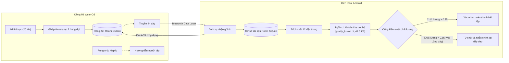

# SteadySense AI: Hệ thống Giám sát Tuân thủ Vận động

### Theo dõi tuân thủ vận động, ước lượng chất lượng tín hiệu cảm biến thời gian thực và từ chối ghi nhận sai trên thiết bị di động


SteadySense AI là hệ thống mã nguồn mở theo dõi tuân thủ bài tập phục hồi chức năng trên Android và Wear OS. Ứng dụng nhận tín hiệu từ cảm biến IMU trên đồng hồ thông minh, đánh giá độ tin cậy của tín hiệu theo thời gian thực và từ chối ghi nhận khi dây đeo bị lỏng hoặc cảm biến bị lệch vị trí, tránh tình trạng ghi nhận sai khi cử động không đạt chuẩn.

---

## Sơ đồ Tổng quan Hệ thống



---

## Điểm nổi bật

| Hạng mục | Khả năng đáp ứng |
| :--- | :--- |
| Giám sát tuân thủ vận động | Đếm và xác minh các cử động lặp lại (gập và duỗi khuỷu tay) trực tiếp trên đồng hồ thông minh. |
| Ngăn lỗi ghi nhận sai | Phát hiện dây đeo bị lỏng hoặc cảm biến lệch vị trí, không tự động tính lượt tập khi tín hiệu suy giảm. |
| Cơ chế từ chối có chọn lọc | Nâng Macro-F1 từ 0.8047 lên 0.8951 và giảm tỷ lệ rủi ro phán đoán sai từ 17.07% xuống 7.26% khi lọc các cửa sổ tín hiệu kém. |
| Chạy AI trực tiếp trên máy | Suy luận ngoại tuyến bằng PyTorch Mobile Lite với mô hình 47.5 KB, độ trễ dưới 5.0 ms và mức chiếm RAM 84.8 MB PSS. |
| Truyền dữ liệu thiết bị tin cậy | Đồng bộ timestamp hai hàng đợi (dung sai 30 ms) và dùng hàng đợi Room Outbox với cơ chế ACK để chống mất gói tin. |
| Giao diện người dùng phục hồi | Độ tương phản cao, phím bấm lớn, nhịp rung phản hồi và thông báo trạng thái trực tiếp cho người cao tuổi. |
| Chế độ thu thập nghiên cứu | Xuất file ZIP qua SAF kèm mã băm SHA-256, phân tách dữ liệu theo từng người và chạy kiểm định QC tự động. |

---

## Kiến trúc Hệ thống

### Ứng dụng đồng hồ (Wear OS)
- Viết bằng Kotlin, target Android SDK 34, giao diện Jetpack Compose cho Wear OS.
- Thu dữ liệu gia tốc kế và con quay hồi chuyển ở tần số 20 Hz qua Android `SensorManager`.
- Bộ đệm ghép cặp timestamp hai hàng đợi cho accel và gyro với dung sai lệch dưới 30 ms.
- Hàng đợi Room SQLite Outbox lưu trữ các cửa sổ tín hiệu chưa gửi, không mất dữ liệu khi đồng hồ khởi động lại.
- Cơ chế bắt tay xác nhận gói tin (ACK) mức ứng dụng qua Wearable Data Layer API.
- Bộ gõ nhịp xúc giác (haptic metronome) điều hòa tốc độ cử động của người tập.

### Ứng dụng điện thoại (Android Phone)
- Viết bằng Kotlin với Jetpack Compose, Material 3 và kiến trúc MVVM.
- Dịch vụ nền `PhoneMessageService` tiếp nhận các gói envelope nhị phân và phản hồi ACK ngay khi ghi vào cơ sở dữ liệu.
- Cơ sở dữ liệu Room SQLite lưu trữ các bảng `imu_windows`, `research_sessions`, `research_participants` kèm test di chuyển schema.
- Giao diện người dùng tối ưu độ tương phản, hỗ trợ người cao tuổi và người suy giảm khả năng vận động.
- Màn hình Research Mode quản lý thu thập dữ liệu, đánh dấu chu kỳ và xuất tệp ZIP qua Storage Access Framework.

### Học máy và suy luận Trên Thiết bị
- Thang mô hình 4 tầng: Lọc theo ngưỡng quy tắc -> Đếm đỉnh chu kỳ -> Mạng tích chập 1D thô -> Kết hợp dựa trên chất lượng tín hiệu.
- Mô hình TorchScript (`quality_fusion.pt`, 47.5 KB) chạy cục bộ, không cần kết nối internet hay máy chủ ngoài.
- Xử lý hai kênh cảm biến gia tốc và con quay hồi chuyển độc lập với cơ chế gán trọng số theo chất lượng tín hiệu.
- Cổng gating tự động từ chối dự đoán khi điểm chất lượng tín hiệu dưới ngưỡng an toàn.

---

## Cấu trúc Thư mục

```text
08_SteadySense_AI/
├── src/                               # Mã nguồn ứng dụng di động Android đa module
│   ├── phone/                         # Ứng dụng điện thoại (Giao diện Compose, runtime PyTorch)
│   │   └── src/main/assets/           # File mô hình nhúng quality_fusion.pt và model_card.json
│   ├── wear/                          # Ứng dụng đồng hồ thông minh (Thu IMU 20 Hz, Room Outbox)
│   └── core/                          # Domain model dùng chung, codec truyền tải, bộ đánh giá quy tắc
├── source_code/                       # Pipeline xử lý dữ liệu và máy học
│   ├── steadysense_ml/                # Package Python: kiểm định dữ liệu, thang mô hình, kịch bản huấn luyện
│   └── from_p3/                       # Snapshot chỉ đọc kế thừa từ nghiên cứu nền tảng (lõi Quality-Aware Fusion)
├── docs/                              # Tài liệu kỹ thuật, hướng dẫn vận hành và mẫu đồng thuận
├── data/                              # Lược đồ dữ liệu, cấu hình thực nghiệm và dữ liệu mô phỏng
├── reports/                           # Báo cáo kỹ thuật, nhật ký QC và kết quả đo đạc thiết bị
├── .github/                           # Quy trình CI (Android và Python) và mẫu báo lỗi
├── LICENSE                            # Toàn văn giấy phép Apache License 2.0 kèm điều khoản miễn trừ y tế
├── CHANGELOG.md                       # Lịch sử thay đổi theo chuẩn Keep a Changelog
└── DEPENDENCIES.md                    # Danh mục thư viện phụ thuộc và thông tin bản quyền
```

---

## Tài liệu Kỹ thuật

- [Hướng dẫn biên dịch từ mã nguồn](docs/BUILD_AND_INSTALL.md): Các bước cài đặt môi trường và biên dịch Android, Python bằng công cụ nguồn mở.
- [Lịch sử huấn luyện và đánh giá thực nghiệm](docs/TRAINING_AND_EXPERIMENTS.md): Dữ liệu 12 người tham gia, kết quả qua các tầng mô hình và quan sát thực tế trên thiết bị (trường hợp lỏng dây so với lệch vị trí).
- [Thẻ mô hình máy học (Model Card)](src/phone/src/main/assets/model_card.json): Thông số kỹ thuật của mô hình, chỉ số đo đạc và giới hạn ứng dụng.
- [Danh mục phụ thuộc và gói đính kèm](DEPENDENCIES.md): Danh sách các thư viện bên thứ ba và giấy phép tương ứng.
- [Nhật ký thay đổi](CHANGELOG.md): Thông tin các phiên bản phát hành theo chuẩn Semantic Versioning.
- [Hướng dẫn thu thập dữ liệu](docs/08_RUNBOOK_RESEARCH_MODE.md): Quy trình vận hành Research Mode, danh mục kiểm tra và bước xác thực chất lượng.
- [Phạm vi kỹ thuật và ranh giới đạo đức](docs/07_G0_KHOA_PHAM_VI_VA_DONG_Y.md): Ranh giới tuyên bố kỹ thuật và quy định bảo mật thông tin người tham gia.
---

## Bảo mật và Quyền riêng tư

- Suy luận AI chạy cục bộ trên thiết bị qua PyTorch Mobile Lite, không gửi dữ liệu cảm biến ra máy chủ ngoài hay dịch vụ đám mây.
- Dữ liệu thô và danh tính người tham gia nghiên cứu được lưu trong phân vùng ứng dụng (sandbox) trên máy, không đưa vào hệ thống quản lý mã nguồn (đã cấu hình qua `.gitignore`).
- Dữ liệu xuất từ Research Mode chỉ sử dụng mã định danh ẩn danh (ví dụ: `P001`), không chứa thông tin cá nhân.
- Khóa ký ứng dụng, file cấu hình cục bộ (`local.properties`), cơ sở dữ liệu SQLite và chứng chỉ được loại trừ khỏi kho mã nguồn.
- Quyền truy cập cảm biến và dịch vụ chạy nền trên Wear OS chỉ phục vụ việc thu thập dữ liệu phiên tập, có thông báo liên tục (ongoing notification) để người dùng nhận biết.

---

## Giấy phép Mã nguồn mở

Mã nguồn do dự án phát triển được phát hành theo giấy phép [Apache License 2.0](LICENSE). Các thư viện bên thứ ba và mã nguồn nền tảng kế thừa tuân theo điều khoản của từng giấy phép tương ứng (xem chi tiết tại [DEPENDENCIES.md](DEPENDENCIES.md) và [provenance_p3_copy.md](provenance_p3_copy.md)).

> [!IMPORTANT]
> SteadySense AI là dự án nghiên cứu kỹ thuật. Hệ thống không thay thế chỉ định y khoa, chẩn đoán, dịch vụ cấp cứu hoặc sự giám sát của kỹ thuật viên phục hồi chức năng và nhân viên y tế.
